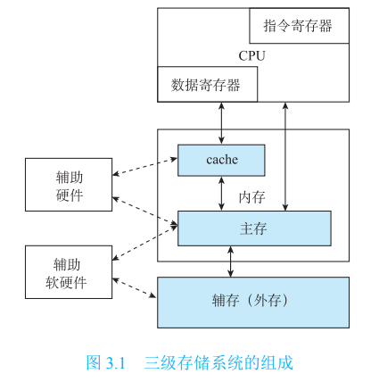
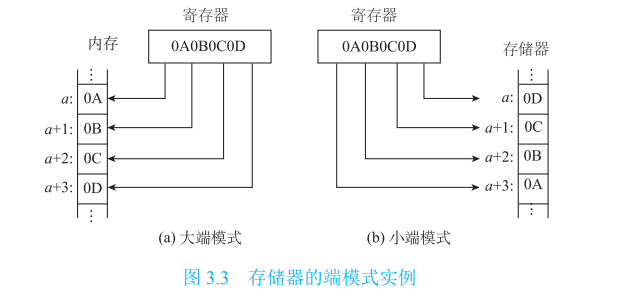

# 计算机组成原理课程学习笔记

## 第三章 存储系统

### 3.1 存储系统概述

#### 3.1.1 存储系统的层次结构

采用存储器分层的策略可以解决存储器成本与性能之间的矛盾，利用不同容量、成本、速度以及功耗的多种存储器组成有机结合的多级存储系统。而构成多级存储系统的依据就是程序的 **局部性原理** 。

##### 1.程序的局部性原理

1. 程序的局部性原理
   含义：在某一段时间内，频繁地访问某一局部的存储器地址空间，而对此范围以外的地址空间则访问较少，称这种现象为 **程序的局部性原理** 。

2. 两个角度分析程序的局部性
   * 时间局部性：最近被访问的信息很可能还要被访问
   * 空间局部性：最近被访问信息的邻近地址的信息也有可能会被访问

##### 2.多级存储系统的组成

1. 内存储器
   含义：正在执行的程序的数据和指令存储在 **CPU能直接访问** 的存储器中，这种狭义的存储器就是内存储器。

   特点：容量小、速度快、价格高

   构成：由半导体器件组成

2. 外存储器（外存）
   含义：为扩大存储容量，需要增加容量更大但允许访问速度稍慢的外存储器（外存），又叫辅助存储器（辅存）。

   特点：相对而言，外存储器容量大、速度慢、价格低

   构成：非半导体器件或固态半导体存储器组成

   注意：**CPU不能直接访问** 外存储器，外存储器中的数据必须调入到内存中，才能被CPU处理。

以上两种存储器内存储器和外存储器构成了两级存储系统。

3. 高速缓冲存储器（cache）
   在常规内存储器和CPU之间增加了速度更快、存储容量更小的半导体高速缓冲存储器，用于存储常规存储器中 **正在使用** 的一些数据块、信息块的副本。

   常规的内存又称为 **主存** 。

因此，内存储器中又分为两个部分，一个是常规的内存储器即主存，另一个是高速缓冲存储器（cache）。由此构成了三级存储系统：

#### 3.1.2  存储器的分类

一位二进制代码位是存储器中最小的存储单位，称为 **存储位元** 。
若干存储位元 ---> 一个存储单元
许多存储单元 ---> 一个存储器

* 按存储介质
  * 半导体存储器：由半导体器件组成的存储器
  * 磁表面存储器：用磁性材料做成的存储器

* 按存取方式
  * 随机存取存储器：存储器中任何存储单元中的内容都可以被随机存取，且存取时间与存储单元的物理位置无关
  * 顺序存取存储器：存储器只能按某种顺序来存取，也就是存取时间与存储单元的物理位置有关，典型代表为磁带

* 按读写功能
  * 只读存储器（Read only Memory）：在存储器在工作过程中只能读出的半导体存储器
  * 随机存取存储器（Random Access Memory）：在存储器在工作过程中既能读出也能写入的半导体存储器

* 按信息易失性
  * 易失性存储器：断电后信息消失
  * 非易失性存储器：断电后信息仍能保留

* 按与CPU的耦合程度
  * 主存
  * 辅存
  * 高速缓冲存储器
> 该分类依据还可以是：按在存储系统中的作用，按存储器在计算机系统中的位置

#### 3.1.3  存储器的编址和端模式

存放一个机器字的存储单元，称为 **字存储单元** ，相应的单元地址称为 **字地址** 。

存放一个字节的存储单元，称为 **字节存储单元** ，相应的单元地址称为 **字节地址** 。

端模式：当一个存储字高于8位时，其内部字节的排列顺序方式称为端模式。端模式分为 **大端** 和 **小端** 两种。

大端：将一个字的高有效字节放在内存的低地址端，而低有效字节放在高地址端。

小端：将一个字的高有效字节放在内存的高地址端，而低有效字节放在低地址端。

#### 3.1.4  存储器的技术指标

* 存储容量：一个存储器所能容纳的存储单元总数
* 存取时间：**一次读操作** 指令发出到该操作完成，将数据读到数据总线上所经历的时间。通常写操作时间与读操作时间相等
* 存储周期：连续启动两次读操作所经历的最小时间
* 存储器带宽：单位时间内存储器所存取的信息量