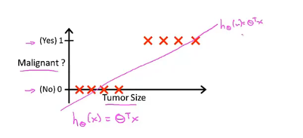
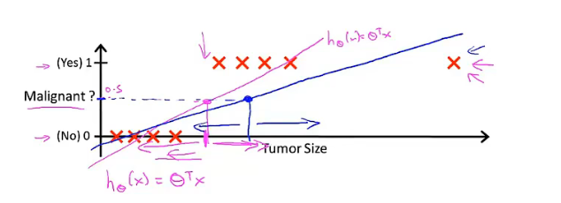

# 吴恩达机器学习课程笔记

## 第六章 Classification - Logistic Regression

本章节主要讲的是分类问题与分类问题所采用的一个经典算法Logistic回归

### 6-1 分类

#### 分类问题的定义

简单定义：要预测的变量y是一个离散值情况下的分类问题

#### 分类问题的一些例子

* 垃圾邮箱分类 Email:Spam / Not Spam
* 网上交易是否存在欺诈的分类问题 Yes / No
* 肿瘤为恶行还是良性 Tumor:Malignant / Benign

以上所有例子中都具有一个共性：我们尝试预测的输出值y都可以有0或1两种取值。

$$y \in \left\{ 0, 1 \right\}$$

> 0：Negetive Class 负类
> 1：Positive Class 正类
> 事实上，具体问题中，将哪一个输出结果视作正类或负类都由人为决定。但我们一般将0视为没有某样东西，而1视作具有要寻找的某样东西。

以上我们所讲的分类问题输出 y 只有0和1两种，后续我们会讨论多分类问题（multi-class classification problem）,其输出可以取诸如 0、1、2、3等值。

#### 第一个具体例子

该例子为判断肿瘤是否为恶性
1代表肿瘤为恶性
0代表肿瘤为良性

线性回归方程：

$$ h_\theta(x) = \theta^T x $$

当把线性回归方程应用到该分类问题分类时，可以将分类器的阈值设为0.5，即：

$$ 
\begin{aligned}
if \, h_\theta(x) \geq 0.5, predict \; y = 1 \\
if \, h_\theta(x) < 0.5, predict \; y = 0 \\
\end{aligned}
$$

因此0.5对应的 Tumor Size,该Tumor Size的左边应该都为良性，右边都为恶性。

若此时我们加一个样本，而重新利用线性回归拟合该数据集，我们可以得到一个新的直线

如图，这是一个十分差劲的线性回归

**因此，把线性回归应用于分类问题是不合适的，不建议将线性回归应用于分类问题**

还有一个问题就是当我们把线性回归应用于分类问题时，通常预测值会远大于1或远小于0尽管我们的样本标签值只有0或1.

